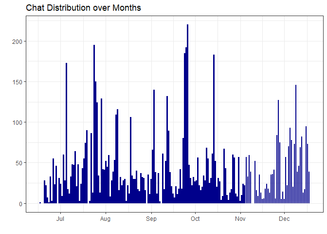
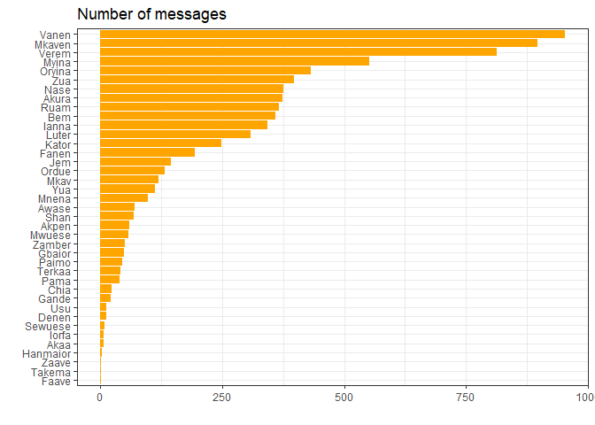
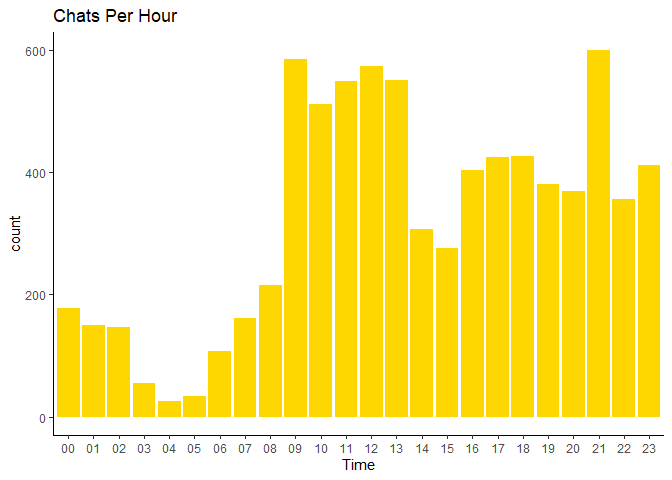
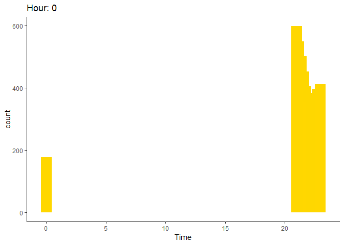
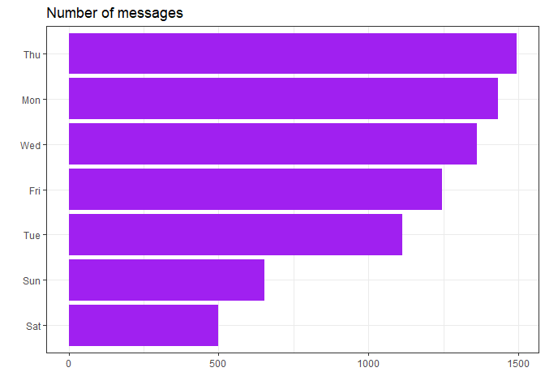
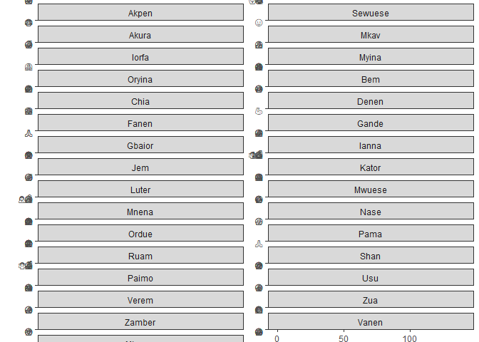
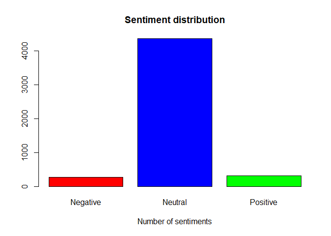
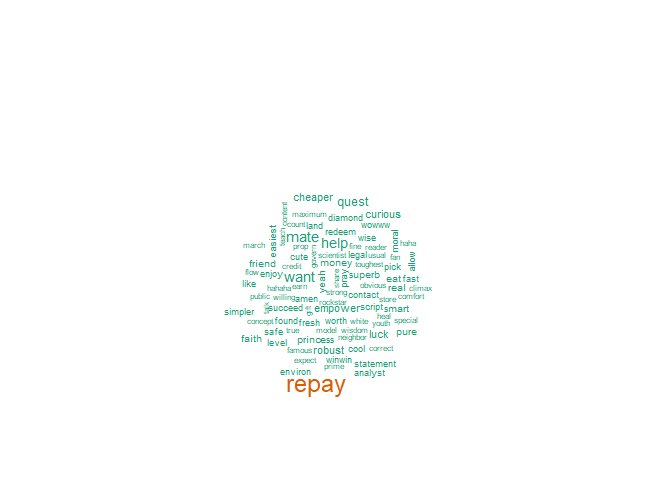
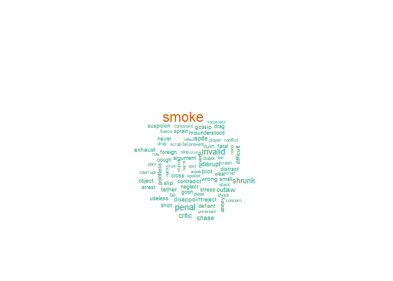
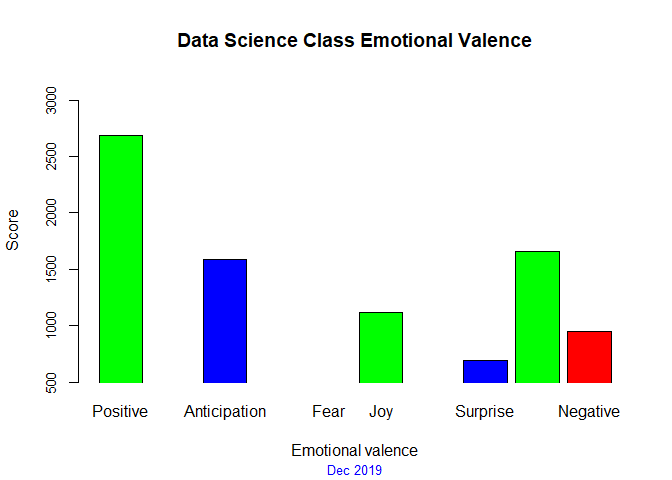

First, let us install / Load relevant packages

```r
if(!"pacman" %in% installed.packages()[,"Package"]) install.packages("pacman")
pacman::p_load(rwhatsapp, plyr, dplyr, readr, ggplot2,stringr, syuzhet, RColorBrewer,
               wordcloud, NLP, tm, SnowballC, RWeka, knitr, tidytext,
               tidyr,RSentiment, DT, sqldf, tidyverse, gganimate, gifski, png, lubridate)
theme_set(theme_bw())
```

Reading data

```r
chat<-rwa_read('C:\\Users\\admin\\Desktop\\git hub\\Sentiments\\_chat.txt')
```


Learning about our data

```r
dim(chat)
```

```
## [1] 7825    6
```

```r
head(chat)
```

```
## # A tibble: 6 x 6
##   time                author text               source          emoji emoji_name
##   <dttm>              <fct>  <chr>              <chr>           <lis> <list>    
## 1 2019-06-17 19:17:15 Faave  <U+200E>Messages to this~  "C:\\Users\\ad~ <chr~ <chr [0]> 
## 2 2019-06-17 19:17:15 <NA>   <U+200E>Karan created th~  "C:\\Users\\ad~ <chr~ <chr [0]> 
## 3 2019-06-19 13:59:27 <NA>   <U+200E>Karan added you    "C:\\Users\\ad~ <chr~ <chr [0]> 
## 4 2019-06-20 20:24:08 Myina  "Hey guys. Hope s~ "C:\\Users\\ad~ <chr~ <chr [0]> 
## 5 2019-06-20 20:25:01 Nase   Not covered mate!  "C:\\Users\\ad~ <chr~ <chr [0]> 
## 6 2019-06-20 20:26:10 Mkaven <U+200E>image omitted      "C:\\Users\\ad~ <chr~ <chr [0]>
```

```r
glimpse(chat)
```

```
## Observations: 7,825
## Variables: 6
## $ time       <dttm> 2019-06-17 19:17:15, 2019-06-17 19:17:15, 2019-06-19 13...
## $ author     <fct> Faave, NA, NA, Myina, Nase, Mkaven, Mkaven, Mkaven, Mkav...
## $ text       <chr> "<U+200E>Messages to this group are now secured with end-to-end...
## $ source     <chr> "C:\\Users\\admin\\Desktop\\git hub\\Sentiments\\_chat.t...
## $ emoji      <list> [<>, <>, <>, <>, <>, <>, <>, <>, <>, "\U0001f44d\U0001f...
## $ emoji_name <list> [<>, <>, <>, <>, <>, <>, <>, <>, <>, "thumbs up: medium...
```
You will see that we have some missing values which we would like to drop

```r
chat<-na.omit(chat)
```
We would like to exclude any deleted message from our analysis. First we have to ensure it's in character format

```r
chat$text<-as.character(chat$text)
chat<-chat[chat$text != 'This message was deleted',]
```
Now we can do some data engineering like extracting the chat hour, day, weekday and month

```r
chat$Day <- format(as.Date(chat$time),"%d")
chat$Month <- format(as.Date(chat$time),"%m")
chat$Hour <- format(as.POSIXct(chat$time), "%H")
chat$weekday<-weekdays(as.POSIXct(chat$time), abbreviate = T)
```

Let's visualize the chat distribution over the months

```r
chat %>%
  mutate(day = date(time)) %>%
  count(day) %>%
  ggplot(aes(x = day, y = n)) +
  geom_bar(stat = "identity", fill="dark blue") +
  ylab("") + xlab("") +
  ggtitle("Chat Distribution over Months") +
  theme_bw()
```

<!-- -->

Visualizing everyone's chat contribution in the group

```r
chat %>%
  mutate(day = date(time)) %>%
  count(author) %>%
  ggplot(aes(x = reorder(author, n), y = n)) +
  geom_bar(stat = "identity", fill = "orange") +
  ylab("") + xlab("") +
  coord_flip() +
  ggtitle("Number of messages") +
  theme_bw()
```

<!-- -->

Chat distribution over the hours of the day

```r
chat%>%
  ggplot(aes(x=Hour)) +
  geom_histogram(stat = "count", fill="gold") +
  labs(title = "Chats Per Hour", x= "Time") +
  theme_classic()
```

```
## Warning: Ignoring unknown parameters: binwidth, bins, pad
```

<!-- -->

Visualizing in animated form

```r
chat$Hour<-as.integer(chat$Hour)   
```

```r
s_plot<-chat%>%
  ggplot(aes(x=Hour)) +
  geom_histogram(stat = "count", fill="gold") +
  labs(title = "Chats Per Hour", x= "Time") +
  theme_classic()
```

```
## Warning: Ignoring unknown parameters: binwidth, bins, pad
```

```r
s_plot + transition_time(chat$Hour) +
  labs(title = "Hour: {frame_time}") +
  shadow_wake(wake_length = 0.1, alpha = FALSE)
```

<!-- -->


Chat distribution over days of the week.

```r
chat %>%
  mutate(day = date(time)) %>%
  count(weekday) %>%
  ggplot(aes(x = reorder(weekday, n), y = n)) +
  geom_bar(stat = "identity", fill = "purple") +
  ylab("") + xlab("") +
  coord_flip() +
  ggtitle("Number of messages") +
  theme_bw()
```

<!-- -->

Check out everyone's favourite emoji

```r
chat %>%
  unnest(emoji) %>%
  count(author, emoji, sort = TRUE) %>%
  group_by(author) %>%
  top_n(n = 6, n) %>%
  ggplot(aes(x = reorder(emoji, n), y = n, fill = author)) +
  geom_col(show.legend = FALSE) +
  ylab("") +
  xlab("") +
  coord_flip() +
  facet_wrap(~author, ncol = 2, scales = "free_y")  +
  ggtitle("Most often used emojis") +
  theme_bw()
```

<!-- -->


Care to know what is in the chats? Let's do some Sentiment Analysis. We will begin by extracting the relevant data (the chat content).
Since image and video posts don't have text messages we would exclude them from our analysis, so, let's drop those values that read 'image omitted' and 'video omitted'.

```r
new_chat<-chat[!endsWith(chat$text, "omitted"),]
my_text<-new_chat$text
```

Data Preprocessing, creating a document term matrix, stemmatization etc

```r
set.seed(100)
sample <- sample(my_text, (length(my_text)))
corpus <- Corpus(VectorSource(list(sample)))
corpus <- tm_map(corpus, removePunctuation)
corpus <- tm_map(corpus, content_transformer(tolower))
corpus <- tm_map(corpus, removeNumbers)
corpus <- tm_map(corpus, stripWhitespace)
corpus <- tm_map(corpus, removeWords, stopwords('english'))
corpus <- tm_map(corpus, stemDocument)
dt_matrix <- DocumentTermMatrix(VCorpus(VectorSource(corpus[[1]]$content)))
final_words <- colSums(as.matrix(dt_matrix))
```
Now we can use the inbuilt function to Calculate Sentiments


Showing distribution of the sentiments

```r
count<-table(our_sentiments$sentiment)
barplot(count, main="Sentiment distribution",
        xlab="Number of sentiments", col = c("red", "blue", "green"))
```

<!-- -->

Now let's seperate the sentiments into positive, negative and neutral

```r
pos_sent<-our_sentiments[our_sentiments$sentiment == 'Positive',]
neg_sent<-our_sentiments[our_sentiments$sentiment == 'Negative',]
neut_sent<-our_sentiments[our_sentiments$sentiment == 'Neutral',]
```

Looking at the sentiments one after the other. First, the Positive sentiments. You can click through the interactive table to see all the sentimental words.

```r
DT::datatable(pos_sent)
```

<!--html_preserve--><div id="htmlwidget-9631cc6b59e3fa0e01ef" style="width:100%;height:auto;" class="datatables html-widget"></div>
<script type="application/json" data-for="htmlwidget-9631cc6b59e3fa0e01ef">{"x":{"filter":"none","data":[["54","59","70","76","85","99","110","115","153","179","193","239","269","272","292","317","329","391","405","409","413","418","426","435","437","453","473","480","486","498","510","525","548","554","555","562","576","580","596","597","602","607","612","621","631","641","654","656","658","711","738","767","770","774","787","798","803","818","846","875","885","893","923","937","940","971","990","999","1031","1067","1103","1138","1144","1147","1148","1151","1162","1170","1184","1192","1201","1212","1220","1285","1301","1303","1304","1316","1330","1332","1336","1337","1341","1342","1348","1366","1397","1407","1420","1423","1433","1450","1452","1453","1460","1461","1467","1474","1483","1486","1498","1513","1526","1539","1548","1561","1582","1588","1595","1596","1603","1610","1621","1622","1644","1646","1658","1701","1722","1733","1751","1763","1780","1786","1791","1804","2037","2038","2079","2100","2132","2133","2141","2173","2219","2225","2229","2230","2233","2267","2270","2305","2307","2328","2338","2340","2351","2365","2369","2382","2407","2458","2466","2488","2492","2509","2524","2527","2539","2542","2647","2661","2666","2670","2697","2701","2714","2740","2759","2779","2878","2888","2897","2957","3046","3074","3080","3100","3151","3155","3183","3191","3202","3216","3219","3220","3222","3249","3251","3258","3268","3269","3271","3273","3275","3278","3282","3284","3287","3311","3312","3326","3327","3372","3375","3381","3387","3396","3406","3418","3448","3477","3480","3505","3517","3519","3520","3552","3593","3619","3626","3634","3682","3687","3688","3697","3709","3721","3745","3752","3771","3781","3813","3814","3816","3820","3821","3831","3872","3878","3890","3921","3933","3939","3953","3959","3960","3971","3998","3999","4000","4018","4019","4020","4028","4040","4059","4060","4077","4078","4113","4165","4239","4252","4274","4288","4293","4294","4607","4611","4652","4682","4685","4726","4745","4746","4749","4760","4761","4766","4768","4769","4770","4772","4773","4778","4784","4786","4789","4793","4794","4796","4807","4811","4814","4847","4850","4860","4892"],["accept","accord","ace","actual","adjust","afford","ahead","aid","allow","amen","analyst","applaud","array","art","assist","august","award","beer","benefit","best","better","big","birthday","bless","bliss","boost","bravo","brilliant","brother","build","buoy","buzz","candid","care","career","cash","center","certain","charger","charm","cheaper","cheer","child","choir","citizen","classic","clean","clear","climax","comfort","concept","constant","contact","content","cool","core","correct","count","credit","curious","cute","dame","daughter","deal","dear","depend","develop","diamond","director","doctor","dream","eager","earn","easier","easiest","eat","effort","elder","empower","endeavor","enjoy","enthusiast","environ","excel","expect","expert","explain","extra","fair","faith","famous","fan","fast","faster","favor","fellow","fine","fit","flow","focus","food","formula","forward","found","free","freedom","fresh","friend","full","fun","gain","general","gift","glad","god","good","govern","grant","great","greater","green","grow","guru","gurus","haha","hahaha","hale","heal","help","hero","highlight","hire","holiday","honest","hope","household","hug","huge","impress","infant","instruct","instructor","interest","iron","job","join","joy","joyous","jump","kind","kiss","lamb","land","laugh","lead","learn","legal","lesson","level","like","lmao","love","luck","main","major","march","master","mate","matter","maximum","model","money","moral","most","music","mutual","nap","neighbor","new","nice","oath","obvious","offer","option","patient","pep","perfect","pick","pool","popular","pray","prefer","present","pride","prime","primer","princess","profession","professor","progress","prop","proper","protect","proud","prove","prowess","public","punctual","pure","quest","question","quick","quicker","reach","reader","real","reason","recommend","redeem","regard","repay","respect","rest","right","robust","rock","rockstar","safe","save","scientist","score","script","sex","shape","share","sharp","shine","shoulder","silent","simpler","sir","skill","smart","smartest","smile","smooth","smoothest","soft","spark","special","spirit","star","statement","status","store","straight","straightforward","strong","succeed","success","succinct","sunset","super","superb","support","sweet","talent","talk","teach","teacher","thank","thrill","top","toughest","tree","true","trust","truth","usual","utmost","victor","want","warm","well","white","whoa","whoop","willing","win","winner","winwin","wireless","wisdom","wise","wish","wizard","won","wonder","woo","woow","word","work","worth","wow","wowww","yay","yeah","yes","youth"],["Positive","Positive","Positive","Positive","Positive","Positive","Positive","Positive","Positive","Positive","Positive","Positive","Positive","Positive","Positive","Positive","Positive","Positive","Positive","Positive","Positive","Positive","Positive","Positive","Positive","Positive","Positive","Positive","Positive","Positive","Positive","Positive","Positive","Positive","Positive","Positive","Positive","Positive","Positive","Positive","Positive","Positive","Positive","Positive","Positive","Positive","Positive","Positive","Positive","Positive","Positive","Positive","Positive","Positive","Positive","Positive","Positive","Positive","Positive","Positive","Positive","Positive","Positive","Positive","Positive","Positive","Positive","Positive","Positive","Positive","Positive","Positive","Positive","Positive","Positive","Positive","Positive","Positive","Positive","Positive","Positive","Positive","Positive","Positive","Positive","Positive","Positive","Positive","Positive","Positive","Positive","Positive","Positive","Positive","Positive","Positive","Positive","Positive","Positive","Positive","Positive","Positive","Positive","Positive","Positive","Positive","Positive","Positive","Positive","Positive","Positive","Positive","Positive","Positive","Positive","Positive","Positive","Positive","Positive","Positive","Positive","Positive","Positive","Positive","Positive","Positive","Positive","Positive","Positive","Positive","Positive","Positive","Positive","Positive","Positive","Positive","Positive","Positive","Positive","Positive","Positive","Positive","Positive","Positive","Positive","Positive","Positive","Positive","Positive","Positive","Positive","Positive","Positive","Positive","Positive","Positive","Positive","Positive","Positive","Positive","Positive","Positive","Positive","Positive","Positive","Positive","Positive","Positive","Positive","Positive","Positive","Positive","Positive","Positive","Positive","Positive","Positive","Positive","Positive","Positive","Positive","Positive","Positive","Positive","Positive","Positive","Positive","Positive","Positive","Positive","Positive","Positive","Positive","Positive","Positive","Positive","Positive","Positive","Positive","Positive","Positive","Positive","Positive","Positive","Positive","Positive","Positive","Positive","Positive","Positive","Positive","Positive","Positive","Positive","Positive","Positive","Positive","Positive","Positive","Positive","Positive","Positive","Positive","Positive","Positive","Positive","Positive","Positive","Positive","Positive","Positive","Positive","Positive","Positive","Positive","Positive","Positive","Positive","Positive","Positive","Positive","Positive","Positive","Positive","Positive","Positive","Positive","Positive","Positive","Positive","Positive","Positive","Positive","Positive","Positive","Positive","Positive","Positive","Positive","Positive","Positive","Positive","Positive","Positive","Positive","Positive","Positive","Positive","Positive","Positive","Positive","Positive","Positive","Positive","Positive","Positive","Positive","Positive","Positive","Positive","Positive","Positive","Positive","Positive","Positive","Positive","Positive","Positive","Positive","Positive","Positive","Positive","Positive","Positive","Positive","Positive","Positive","Positive","Positive","Positive","Positive","Positive","Positive","Positive","Positive","Positive","Positive","Positive","Positive"]],"container":"<table class=\"display\">\n  <thead>\n    <tr>\n      <th> <\/th>\n      <th>text<\/th>\n      <th>sentiment<\/th>\n    <\/tr>\n  <\/thead>\n<\/table>","options":{"order":[],"autoWidth":false,"orderClasses":false,"columnDefs":[{"orderable":false,"targets":0}]}},"evals":[],"jsHooks":[]}</script><!--/html_preserve-->

Now let's bring all the positive words into one bag. We will limit ourselves to words with freq of at least 10 just for clarity sake.

```r
layout(matrix(c(1, 2), nrow=2), heights=c(1, 4))
par(mar=rep(0, 4))
plot.new()
set.seed(100)
wordcloud(pos_sent$text,final_words,min.final_words=10,colors=brewer.pal(6,"Dark2"))
```

<!-- -->

Negative Sentiments

```r
DT::datatable(neg_sent)
```

<!--html_preserve--><div id="htmlwidget-1c77e9358239f1ed7097" style="width:100%;height:auto;" class="datatables html-widget"></div>
<script type="application/json" data-for="htmlwidget-1c77e9358239f1ed7097">{"x":{"filter":"none","data":[["38","47","49","100","123","125","132","188","207","257","270","299","325","352","353","363","382","430","431","432","434","436","438","440","447","458","462","463","464","474","483","484","497","505","507","511","513","545","547","560","599","601","604","613","668","671","692","735","739","751","768","773","779","789","813","835","839","840","851","854","856","884","894","934","941","950","955","956","961","966","984","988","1003","1008","1017","1034","1036","1044","1045","1048","1051","1091","1101","1112","1113","1118","1127","1129","1231","1298","1326","1333","1343","1344","1351","1357","1365","1372","1374","1379","1402","1413","1435","1440","1442","1501","1569","1572","1584","1593","1619","1620","1641","1667","1673","1681","1684","1691","1719","1766","1767","2043","2056","2064","2090","2101","2124","2148","2159","2207","2224","2238","2260","2266","2282","2303","2322","2363","2364","2386","2438","2450","2451","2452","2461","2481","2510","2549","2584","2631","2632","2638","2640","2663","2695","2696","2738","2746","2757","2880","2893","2976","2981","2999","3002","3012","3065","3069","3105","3120","3121","3126","3143","3144","3152","3153","3206","3209","3235","3272","3329","3330","3341","3351","3399","3423","3426","3429","3473","3482","3494","3509","3511","3532","3534","3543","3544","3551","3603","3606","3628","3629","3681","3685","3699","3710","3711","3712","3719","3728","3734","3735","3760","3782","3789","3802","3803","3804","3807","3815","3819","3827","3828","3886","3891","3892","3893","3897","3915","3951","3955","3966","3969","3974","3984","3988","4002","4004","4035","4036","4062","4074","4105","4179","4245","4278","4280","4317","4536","4546","4559","4577","4593","4651","4662","4674","4686","4702","4704","4723","4730","4774","4806","4821","4825","4845","4919"],["abandon","abrupt","absent","afraid","alarm","alert","alien","anaconda","annoy","argument","arrest","astray","avoid","backward","bad","bang","beat","black","blah","blame","blast","blind","block","blow","bomb","bore","bother","bottom","bout","break","broke","broken","bug","bum","bump","burden","burn","cancel","cancer","case","chase","cheap","cheat","chill","cloud","clueless","cold","con","concern","conflict","constraint","contend","contradict","coop","cough","crack","crap","crash","crime","critic","cross","cut","damn","dead","death","deep","default","defiant","delay","demand","destroy","detriment","diaper","die","difficult","disappoint","disclaim","disregard","disrupt","distant","distract","doubt","drag","drone","drop","drunk","dumb","dump","error","exhaust","fail","fall","fatal","fault","fear","fee","fell","fever","fiasco","fight","fire","flaw","fool","foreign","forget","gambler","goon","gossip","grab","grate","guilt","gun","hack","handicap","hang","hard","harm","hate","hell","hit","hive","hurt","idiot","ill","incorrect","infect","insist","interrupt","invalid","jealous","john","junk","kick","kill","knock","lack","late","less","lesser","limit","lone","lose","loss","lost","low","mad","margin","mean","mess","miser","miss","mistaken","misunderstood","monster","mum","murder","neglect","nervous","never","object","odd","ouch","outlaw","overload","overthink","pain","peculiar","penal","pig","player","pleas","plot","pointless","poison","poor","pop","pretend","prevent","problem","protest","quit","quiz","ram","rant","recount","regress","regret","reject","resign","restrict","revert","riotous","risk","rough","row","rude","ruin","sad","scam","scare","scrap","scratch","sever","shake","shed","shit","shock","shoot","shot","shrunk","sick","sicken","sink","skip","slack","slip","slow","slower","small","smell","smoke","soak","sober","spent","spite","split","spoiler","sprain","stalk","stop","storm","stress","strike","stuck","stupid","subject","suck","suffer","suspect","suspicion","tank","tax","tether","tight","torn","trick","trigger","twist","ugh","uncertain","unknown","upset","useless","victim","virus","wait","warn","weak","wear","weird","wen","witch","worst","wrong","wtf","yawn","zip"],["Negative","Negative","Negative","Negative","Negative","Negative","Negative","Negative","Negative","Negative","Negative","Negative","Negative","Negative","Negative","Negative","Negative","Negative","Negative","Negative","Negative","Negative","Negative","Negative","Negative","Negative","Negative","Negative","Negative","Negative","Negative","Negative","Negative","Negative","Negative","Negative","Negative","Negative","Negative","Negative","Negative","Negative","Negative","Negative","Negative","Negative","Negative","Negative","Negative","Negative","Negative","Negative","Negative","Negative","Negative","Negative","Negative","Negative","Negative","Negative","Negative","Negative","Negative","Negative","Negative","Negative","Negative","Negative","Negative","Negative","Negative","Negative","Negative","Negative","Negative","Negative","Negative","Negative","Negative","Negative","Negative","Negative","Negative","Negative","Negative","Negative","Negative","Negative","Negative","Negative","Negative","Negative","Negative","Negative","Negative","Negative","Negative","Negative","Negative","Negative","Negative","Negative","Negative","Negative","Negative","Negative","Negative","Negative","Negative","Negative","Negative","Negative","Negative","Negative","Negative","Negative","Negative","Negative","Negative","Negative","Negative","Negative","Negative","Negative","Negative","Negative","Negative","Negative","Negative","Negative","Negative","Negative","Negative","Negative","Negative","Negative","Negative","Negative","Negative","Negative","Negative","Negative","Negative","Negative","Negative","Negative","Negative","Negative","Negative","Negative","Negative","Negative","Negative","Negative","Negative","Negative","Negative","Negative","Negative","Negative","Negative","Negative","Negative","Negative","Negative","Negative","Negative","Negative","Negative","Negative","Negative","Negative","Negative","Negative","Negative","Negative","Negative","Negative","Negative","Negative","Negative","Negative","Negative","Negative","Negative","Negative","Negative","Negative","Negative","Negative","Negative","Negative","Negative","Negative","Negative","Negative","Negative","Negative","Negative","Negative","Negative","Negative","Negative","Negative","Negative","Negative","Negative","Negative","Negative","Negative","Negative","Negative","Negative","Negative","Negative","Negative","Negative","Negative","Negative","Negative","Negative","Negative","Negative","Negative","Negative","Negative","Negative","Negative","Negative","Negative","Negative","Negative","Negative","Negative","Negative","Negative","Negative","Negative","Negative","Negative","Negative","Negative","Negative","Negative","Negative","Negative","Negative","Negative","Negative","Negative","Negative","Negative","Negative","Negative","Negative","Negative","Negative","Negative","Negative","Negative","Negative","Negative","Negative","Negative","Negative","Negative","Negative"]],"container":"<table class=\"display\">\n  <thead>\n    <tr>\n      <th> <\/th>\n      <th>text<\/th>\n      <th>sentiment<\/th>\n    <\/tr>\n  <\/thead>\n<\/table>","options":{"order":[],"autoWidth":false,"orderClasses":false,"columnDefs":[{"orderable":false,"targets":0}]}},"evals":[],"jsHooks":[]}</script><!--/html_preserve-->
Wordcloud of negative sentiments

```r
layout(matrix(c(1, 2), nrow=2), heights=c(1, 4))
par(mar=rep(0, 4))
plot.new()
set.seed(100)
wordcloud(neg_sent$text,final_words, min.final_words=10,colors=brewer.pal(6,"Dark2"))
```

<!-- -->


Let us compare the Proportions of positive, negative and neutral sentiments
Total sentiments

```r
total_sent<-length(our_sentiments$sentiment)
```
Positive Sentiments

```r
pos_count<-sqldf("select count(sentiment) from our_sentiments where sentiment='Positive'")
print(pos_count)
```

```
##   count(sentiment)
## 1              309
```

```r
pos_prop<-pos_count/total_sent * 100
print(paste("The proportion of positive sentiments is ", round(pos_prop, digits = 1), "%"))
```

```
## [1] "The proportion of positive sentiments is  6.3 %"
```
Negative Sentiments

```r
neg_count<-sqldf("select count(sentiment) from our_sentiments where sentiment='Negative'")
print(neg_count)
```

```
##   count(sentiment)
## 1              267
```

```r
neg_prop<-neg_count/total_sent * 100
print(paste("The proportion of Negative sentiments is ", round(neg_prop, digits = 1), "%"))
```

```
## [1] "The proportion of Negative sentiments is  5.4 %"
```

Neutral Sentiments

```r
neut_count<-sqldf("select count(sentiment) from our_sentiments where sentiment='Neutral'")
print(neut_count)
```

```
##   count(sentiment)
## 1             4353
```

```r
neut_prop<-neut_count/total_sent * 100
print(paste("The proportion of Neutral sentiments is ", round(neut_prop, digits = 1), "%"))
```

```
## [1] "The proportion of Neutral sentiments is  88.3 %"
```
Let us do Hypothesis testing using Fisher Exact probability test to see if there's any statistical difference between the overall positive and negative sentiments.

```r
res <- prop.test(x = c(309, 267), n = c(4929, 4929))
res
```

```
## 
## 	2-sample test for equality of proportions with continuity correction
## 
## data:  c(309, 267) out of c(4929, 4929)
## X-squared = 3.0995, df = 1, p-value = 0.07832
## alternative hypothesis: two.sided
## 95 percent confidence interval:
##  -0.000940694  0.017982690
## sample estimates:
##    prop 1    prop 2 
## 0.0626902 0.0541692
```
Since our p_value of 0.078 is greater than 0.05, we fail to reject the null hypothesis and conclude that there's no statistical difference between our negative and positive sentiments. 

Another way to analyze sentiments is to use the Syuzhet's algorithm to extract and plot the emotional trajectory.
Here, each chat is taken as a sentence and assigned a positive or negative score based on the total score of all the words in it. This is called Emotional Valence.We will be using the NRC option which is based on simple lexicons.
As usual, we will start with some cleaning to remove html links, punctuations and non-alphanumeric characters like emojis.


```r
new_text<-gsub("http[^[:blank:]]+","",my_text)
new_text<-gsub("@\\w+","",new_text)
new_text<-gsub("[[:punct:]]"," ",new_text)
new_text<-gsub("[^[:alnum:]]"," ",new_text)
```
Now we can use the NRC function to extract the sentences and calculate valence


```r
new_sentiment<-get_nrc_sentiment((new_text))
```
Calculating the valence


```r
new_sentiment.positive =sum(new_sentiment$positive)
new_sentiment.anger =sum(new_sentiment$anger)
new_sentiment.anticipation =sum(new_sentiment$anticipation)
new_sentiment.disgust =sum(new_sentiment$disgust)
new_sentiment.fear =sum(new_sentiment$fear)
new_sentiment.joy =sum(new_sentiment$joy)
new_sentiment.sadness =sum(new_sentiment$sadness)
new_sentiment.surprise =sum(new_sentiment$surprise)
new_sentiment.trust =sum(new_sentiment$trust)
new_sentiment.negative =sum(new_sentiment$negative)
```

Let's create a bar chart to visualize the emotional scores


```r
yAxis <- c(new_sentiment.positive,
           + new_sentiment.anger,
           + new_sentiment.anticipation,
           + new_sentiment.disgust,
           + new_sentiment.fear,
           + new_sentiment.joy,
           + new_sentiment.sadness,
           + new_sentiment.surprise,
           + new_sentiment.trust,
           + new_sentiment.negative)
xAxis <- c("Positive","Anger","Anticipation","Disgust","Fear","Joy","Sadness","Surprise","Trust","Negative")
colors <- c("green","red","blue","orange","red","green","orange","blue","green","red")
yRange <- range(0,yAxis) + 500
barplot(yAxis, names.arg = xAxis,
        xlab = "Emotional valence", ylab = "Score", main = "Data Science Class Emotional Valence", sub = "Dec 2019", col = colors, border = "black", ylim = yRange, xpd = F, axisnames = T, cex.axis = 0.8, cex.sub = 0.8, col.sub = "blue")
```

<!-- -->

```r
colSums(new_sentiment)
```

```
##        anger anticipation      disgust         fear          joy      sadness 
##          316         1591          247          461         1119          472 
##     surprise        trust     negative     positive 
##          691         1659          946         2690
```

So, here we are at the end of this analysis. Like every Data Science project, the end goal was to find insights. We started with nothing in mind, but in the end two things stand out for me:
1. The best day of the week to start a discussion and get the most contributions is Thursday. Did I hear you say expect slow response on Saturdays? There you have it. 
2. If you are the type that rarely get on your phone, at least check the group chat at 9AM and 9PM everyday for trending topics.
